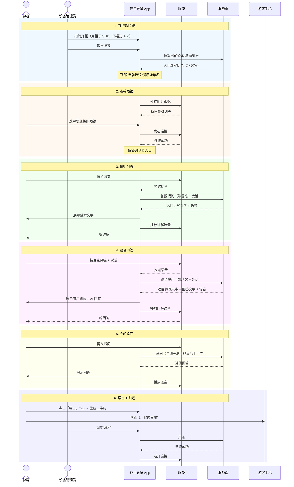

# 齐目导览 · Android 演示 App 产品需求文档

> **版本**: v1.3 | **日期**: 2026-06-30 | **状态**: 待甲方评审
>
> 本文档描述 AI 智能导览系统一期 Android 演示 App「齐目导览」的完整产品设计，基于 UI 设计稿编写。

---

## 目录

1. [产品概述](#1-产品概述)
2. [产品流程图（泳道图）](#2-产品流程图泳道图)
3. [页面结构总览](#3-页面结构总览)
4. [设备管理页](#4-设备管理页)
5. [对话页](#5-对话页)
6. [导出页](#6-导出页)
7. [边界 Case 处理汇总](#7-边界-case-处理汇总)

---

## 1. 产品概述

### 1.1 定位

「齐目导览」Android 演示 App 是一期 Demo 的 **C 端载体**（不上架应用商店，仅内部 APK 分发）。游客在寺庙/博物馆现场，由设备管理员协助完成"取眼镜 → 连接眼镜 → 拍照/语音提问 → 听讲解 → 归还"的完整体验。

### 1.2 核心功能一句话

**先连接眼镜 → 进入对话页**，游客通过眼镜物理按键触发拍照或语音提问，App 实时同步展示对话内容，AI 讲解词既通过眼镜耳机播报，也在 App 屏幕以文字呈现。**游客可通过「导出」功能生成二维码，扫码后通过小程序导出本次连接的完整记录**。

### 1.3 用户操作路径

```
管理员扫码开柜取眼镜 + 手机 → 打开「齐目导览」App（自动获取当前设备-场馆绑定）
→ 连接眼镜 → 进入对话页 → 游客戴眼镜拍照/语音提问
→ 眼镜耳机播放讲解 → 游客点击「导出」生成二维码并扫码带走数据
→ 归还眼镜 + 手机 → 当前对话结束
```

### 1.4 三个页面

| 页面 | Tab 名称 | 功能 | 准入条件 |
|------|---------|------|---------|
| 设备管理 | 设备 | 展示设备信息 + 扫描/连接/断开操作 | 无（未连接也可进入） |
| 对话 | 对话 | 展示拍照/语音问答内容 | **必须已连接眼镜** |
| 导出 | 导出 | 生成导出二维码，扫码后通过小程序获取本次连接的完整数据 | 眼镜已连接（有会话数据） |

UI稿：https://www.figma.com/design/EULCfAfm70CYpKK517RfTr/%E9%BD%90%E7%9B%AE%E5%AF%BC%E8%A7%88?node-id=2-1762&t=G8WwrcHHgSEasocw-0

### 1.5 前置依赖条件

为保证 App 正常工作，依赖以下关键前提：

#### ⭐ 设备-场馆绑定关系已知

App 必须能明确"**当前眼镜属于哪个场馆**"——所有 AI 检索都限定在该场馆的展品知识库内，否则会出现"游客在故宫拍了一尊佛像，AI 却讲了少林寺的内容"这类错配。

**一期 Demo 方案：运营后台预绑定**

- 眼镜入库/投放时，由项目方在运营后台录入"这台眼镜属于哪个场馆"
- App 启动后**自动**从服务端拉取当前设备的归属场馆，作为后续 AI 检索的过滤范围
- **App 端不需要任何扫码或选择操作**，开柜后即可直接使用
- 一期 Demo 默认做两个假账户 / 两个假场馆（如"中国美术馆"、"故宫博物院"）来演示

> 后续若设备会跨场馆调拨，可扩展为"柜子 SDK 在开柜时上报场馆"——但一期不做。

---

## 2. 产品流程图（泳道图）

> **说明**：以下泳道图覆盖从"游客到达场馆"到"归还眼镜查看回顾"的完整端到端流程，表达清楚 5 端之间的关键交互，省略接口/事件/中间处理等实现细节。



### 2.1 6 个阶段的产品意图

| # | 阶段 | 谁主导 | 关键意图 |
|---|------|-------|---------|
| 1 | 开柜取眼镜 | 设备管理员 | 取出眼镜 + App 自动识别设备归属场馆 |
| 2 | 连接眼镜 | 设备管理员 / 游客 | App 与眼镜建立实时通道，是进入对话页的准入条件 |
| 3 | 拍照问答 | 游客 | "我拍了什么"→ "AI 给我讲什么"，图片是问题 |
| 4 | 语音问答 | 游客 | "我问什么"→ "AI 答什么"，语音是问题 |
| 5 | 多轮追问 | 游客 | 在同一会话内持续提问，AI 自动理解追问的指代 |
| 6 | 导出 + 归还 | 游客 + 设备管理员 | 游客导出本次连接全部数据后，管理员归还眼镜，会话结束 |

---

## 3. 页面结构总览

App 共 3 个页面，采用底部 Tab 导航。设备 Tab 随时可访问；对话和导出 Tab 需已连接眼镜（未连接时灰显并提示）。

```
┌──────────────────────────────────────────┐
│         Status Bar                        │
├──────────────────────────────────────────┤
│  [Logo]  齐目导览            设备在线    │  ← 全局头部（常驻）
├──────────────────────────────────────────┤
│                                          │
│        [页面内容区域]                       │
│        根据当前 Tab + 连接状态切换          │
│                                          │
│                                          │
├──────────────────────────────────────────┤
│   设备   │    对话    │    导出           │
│  (Tab 1) │  (Tab 2)  │  (Tab 3)         │
└──────────────────────────────────────────┘
```

### 3.1 三个 Tab 与页面状态的关系

| Tab | 名称 | 未连接眼镜 | 已连接眼镜 |
|-----|------|------------|------------|
| Tab 1 | **设备** | 显示「未连接」设备卡 + 扫描连接按钮 | 显示「已连接」设备信息卡 + 设备详情表 |
| Tab 2 | **对话** | **灰显不可点击**，提示"请先连接眼镜" | 正常显示对话流 |
| Tab 3 | **导出** | **灰显不可点击**，提示"请先连接眼镜" | 正常显示，展示"生成二维码"按钮 + 导出说明 |

**关键约束**：

- 眼镜连接断开（主动断开/超出范围/眼镜关机）→ App 立即从对话页跳转回设备页，**当前会话数据保留（可通过导出获取）**
- 已连接时切换到对话页 → 同一会话保持不丢失；切换到导出页再回对话页，**对话内容仍在**

### 3.2 全局头部

```
┌──────────────────────────────────────────┐
│  [眼镜Logo]  齐目导览         设备在线    │
└──────────────────────────────────────────┘
```

- **左侧 Logo + 名称**：固定品牌展示
- **右侧 "设备在线"**：App 与服务端连接的指示
    - 绿色 = 在线
    - 灰色 = 离线（无网或服务异常）

### 3.3 三个页面的全局配色

- **主色（强调色）**：深棕金色，用于主按钮、激活 Tab、强调文字
- **辅助色**：浅米色背景
- **状态色**：绿色（已连接/成功）、灰色（未连接/禁用）、红色（异常/失败）、黄色（警告）

---

## 4. 设备管理页

> **准入条件**：无
> **页面职责**：展示设备连接状态 + 设备信息。**连接成功是进入对话页的前置条件**。

### 4.1 两种页面状态

设备管理页有 **未连接** 和 **已连接** 两种状态，由当前眼镜连接情况决定。

### 4.2 状态一：未连接


**布局元素**：

| 位置 | 元素 | 说明 |
|------|------|------|
| 顶部 | 页面标题"设备管理" + 副标题"连接您的 AI 眼镜以开始导览" | 固定文案 |
| 卡片 | 设备名 + 设备 ID + "未连接"标签（灰色） | 设备信息卡，显示上次使用过的设备（如有），否则显示占位 |
| 主按钮 | "扫描并连接眼镜"（深棕金色实心按钮） | 点击进入扫描流程 |
| 提示文字 | "连接眼镜后可使用实时讲解功能。未连接时可查看设备信息和管理连接。" | 静态文案 |

**交互**：

- 点击主按钮 → 进入扫描流程（见 §4.4）
- 未连接时，"对话"Tab 灰显不可点击
- 设备卡灰显但可点击（点击进入扫描流程，作为备选入口）

### 4.3 状态二：已连接


**设备信息卡（顶部高亮卡）**：

| 位置 | 元素 | 说明 |
|------|------|------|
| 左上 | 眼镜图标 + 设备名 | "AiGlasses X1 Pro" |
| 右上 | "已连接"标签（绿底） | 标识当前连接状态 |
| 设备名下方 | 设备 ID | "AG-X1-2024-0312"，作为唯一标识 |
| 卡片底部 | 三栏实时数据 | 电量、信号、固件版本 |

**三栏实时数据**：

| 字段 | 示例 | 更新机制 |
|------|------|---------|
| 电量 | 78% | 眼镜实时上报，App 持续更新 |
| 信号 | -42dBm | 实时显示蓝牙信号强度 |
| 固件 | v2.4.1 | 连接时获取一次，后续不变 |

**设备详情表（下方属性列表）**：

| 字段 | 数据来源 | 示例 |
|------|---------|------|
| 设备型号 | 设备信息 | AiGlasses X1 Pro |
| 序列号 | 设备唯一标识 | AG-X1-2024-0312 |
| 连接方式 | 连接协议 | 低功耗蓝牙 5.3 |
| 本次连接时长 | 实时计算 | 00:12:34（HH:MM:SS，秒级刷新） |
| 摄像头分辨率 | 设备规格 | 12MP / 4K@30fps |

**交互**：

- 点击底部"对话"Tab → 进入对话页开始提问
- 设备卡可点击 → 进入设备详情/断开页
- 本次连接时长每秒刷新一次

### 4.4 连接流程（点击"扫描并连接眼镜"后）

```
点击"扫描并连接眼镜"
       │
       ▼
   App 开始扫描附近眼镜
       │
       ├─ 30s 内发现设备 ──→ 列出可选设备 ──→ 选中一个 ──→ 连接中
       │                                              │
       │                                              ├─ 10s 内连上 ──→ 切换到"已连接"状态
       │                                              └─ 超时/失败 ────→ 提示 + 重试
       │
       └─ 30s 未发现 ────→ 提示"未发现设备" + "重新扫描"按钮
```

**扫描期间**：

- 设备卡显示"扫描中..."状态
- 主按钮变为"取消扫描"
- 用户可随时取消

**连接期间**：

- 设备卡显示"连接中..."状态（带动画）
- 不可取消，需等待结果

### 4.5 异常情况处理

| 场景 | App 表现 | 用户可操作 |
|------|---------|-----------|
| 扫描超时（30s 未发现设备） | 提示"未发现设备，请确认眼镜已开机" | 点击"重新扫描" |
| 连接超时（10s 未连上） | 提示"连接超时，请靠近眼镜重试" | 点击"重试" |
| 连接被拒绝 | 提示"连接失败，请重启眼镜后再试" | 点击"重试" |
| 眼镜运行中断开 | 任意页面 Toast 提示"眼镜连接已断开" + 自动回设备页 | 重新连接 |
| 眼镜电量过低（< 10%） | 设备卡电量数字变红 + 警告 Toast | 继续使用或归还 |
| 眼镜电量耗尽（≤ 3%） | 强制结束当前对话（数据保留在服务端，游客需在结束前通过导出带走），提示"眼镜电量耗尽，请归还" | 归还眼镜 |

---

## 5. 对话页

> **准入条件**：眼镜已连接（App 已自动获取当前设备-场馆绑定）
> **页面职责**：实时展示用户与 AI 的对话内容。**用户的所有输入通过眼镜物理按键触发**，手机端仅展示对话、查看讲解词、主动重播语音。

### 5.1 页面布局

<table>
<tr>
<td></td>
<td></td>
</tr>
</table>

### 5.2 顶部：当前场馆信息条

| 元素 | 说明 |
|------|------|
| 标签"📍 当前场馆" | 小标签，固定位置 |
| 场馆名 | "中国美术馆"，主标题字号 |
| 副标题 | 场馆简介或展厅信息，如"近现代中国油画藏品·三层展厅" |
| 右侧状态标签 | 实时显示当前 AI 状态：空闲 / 识别中 / 讲解中 |

**状态标签**：

- 🟢 空闲：AI 无正在进行的任务
- 🟡 识别中：用户已拍照，AI 正在识别展品
- 🟡 思考中：用户已提问，AI 正在生成回答
- 🟢 讲解中：AI 已生成讲解词，眼镜正在播放语音（或刚结束）

### 5.3 三种对话气泡

#### 5.3.1 用户拍照气泡

| 属性 | 内容 |
|------|------|
| 触发方式 | 游客按下眼镜拍照键 |
| 气泡内容 | 照片缩略图 + 可选文字问题 + 时间戳 |
| 位置 | 靠右对齐（用户侧） |
| 背景 | 浅色 |
| 角标 | 右下/右上小图标 📷 |
| 状态变化 | 发送中（图片上方有半透明遮罩 + 加载动画）→ 发送成功（遮罩消失）→ 发送失败（红色感叹号） |

> **设计意图**：游客拍展品时，多数情况不附带文字问题；本气泡主要呈现"我拍了什么"。

#### 5.3.2 用户语音气泡

| 属性 | 内容 |
|------|------|
| 触发方式 | 游客按下眼镜麦克风键并说话 |
| 气泡内容 | 语音转写的文字内容 + 时间戳 |
| 位置 | 靠右对齐（用户侧） |
| 背景 | 浅色 |
| 角标 | 右下/右上小图标 🎤 |
| 状态变化 | 收音中（"🎤 正在聆听..."带声波动画）→ 识别中（"📝 转写中..."带加载动画）→ 展示转写文字 |

> **设计意图**：游客的语音被自动转写为文字后展示，**用户不必"听自己的声音回放"**，但能看到 AI 理解了什么。

#### 5.3.3 AI 讲解气泡

| 属性 | 内容 |
|------|------|
| 触发方式 | 服务端完成 AI 讲解词生成 |
| 气泡内容 | AI 讲解文字（流式逐字展示）+ 分隔线 + "📷 眼镜绘图" 状态行 + 时间戳 |
| 位置 | 靠左对齐（AI 侧） |
| 背景 | 白色 + 浅灰边框 |
| 角标 | 左上 🤖 图标 |
| 视觉呈现 | 文字逐 token 出现，模拟打字效果，结束后定格 |
| 底部状态行 | 分隔线下方显示眼镜侧的状态（如"📷 眼镜绘图"、"🔊 正在播放"、"⏸ 播放结束"） |

> **设计意图**：文字讲解与语音讲解同步，用户既能在眼镜耳机里听，也能在 App 上看清楚讲解内容（演示场景下销售可向观众展示文字）。

### 5.4 底部：操作栏（固定三个按钮）

| 按钮 | 图标 | 用途 | 用户可点击 |
|------|------|------|----------|
| 拍照提问 | 📷 | 提示游客"按眼镜拍照键提问" | ❌ 不可点击（仅文字提示） |
| 语音提问 | 🎤 | 提示游客"按眼镜麦克风键提问" | ❌ 不可点击（仅文字提示） |
| 语音播放 | 🔊 | 主动重播最近一次 AI 讲解音频 | ✅ 可点击（用于演示或听不清时重听） |

**操作提示语**（按钮下方固定文案）：

> 通过眼镜操作提问，手机端仅供查看

### 5.5 多轮对话行为

- 同一会话内，**游客可连续提问**（拍照或语音），对话流自然延续
- 游客的追问（如"这种技法是怎么形成的？"）会**自动关联上一轮展品上下文**（即"这幅画"指的是《泼彩山水》）
- 一次会话 = 一次眼镜连接，结束于"归还眼镜"或"眼镜断开"

### 5.6 边界 Case 处理

#### 5.6.1 拍照识别失败

```
┌──────────────────────────────────────┐
│  ⚠️  抱歉，没看清楚                   │
│                                      │
│  建议您：                              │
│  • 靠近展品再拍一张                   │
│  • 避开玻璃反光和强光                 │
│  • 确保展品在画面中央                 │
│                                      │
│            [再拍一次]                  │
└──────────────────────────────────────┘
```

"再拍一次"按钮点击后仅提供文字引导（实际拍照仍通过眼镜按键）。

#### 5.6.2 拍到了非本场馆内容

```
┌──────────────────────────────────────┐
│  ℹ️  这可能不是本场馆的展品            │
│                                      │
│  当前在【中国美术馆】，您可以拍摄      │
│  近现代油画藏品等区域内的展品。        │
│                                      │
│            [知道了]                    │
└──────────────────────────────────────┘
```

#### 5.6.3 网络异常（发送中）

- 用户气泡角标变红感叹号 ⚠️
- 底部弹出 Toast："网络不稳定，请靠近场馆 WiFi 区域"
- 气泡可点击重试

#### 5.6.4 眼镜中途断开

弹窗：

```
┌──────────────────────────┐
│  🔌 眼镜连接已断开        │
│                          │
│  当前对话数据已保留        │
│  可重新连接继续导览      │
│  或通过[导出]带走数据        │
│        [重新连接]          │
└──────────────────────────┘
```

- 点击"重新连接" → 跳转设备页
- 断开前已产生的会话数据保存在服务端，游客可在导出 Tab 生成二维码带走

#### 5.6.5 眼镜低电量预警

- 顶部状态栏电量图标变红 🔴
- 对话页顶部插入黄色提示条（可关闭）：
  > ⚡ 眼镜电量不足 (8%)，建议尽快归还
- 电量 ≤ 3% 时强制结束当前对话（数据保留在服务端，游客需在结束前通过导出带走）

#### 5.6.6 连续快速按键

- 2 秒内连续触发拍照/语音 > 3 次时，忽略第 3 次之后的事件
- Toast 提示："请等待当前识别完成再提问"

#### 5.6.7 语音说话太短

- 收音时长 < 1 秒时不上传
- 提示："说话时间太短，请长按说话键说完再松开"

#### 5.6.8 服务端正忙（限流）

```
┌──────────────────────────────────────┐
│  🕐 当前使用人数较多                  │
│                                      │
│  前面还有 X 人在等待                  │
│  预计等待时间：约 X 秒                │
│                                      │
│  您的问题已排队，稍后会自动处理        │
└──────────────────────────────────────┘
```

### 5.7 对话页交互约束

| 约束 | 说明 |
|------|------|
| **手机端不可文字输入** | 底部"拍照提问""语音提问"为引导提示，不是触发按钮 |
| **不可删除消息** | Demo 阶段不做 |
| **新消息自动滚到底部** | 用户手动上滑查看历史时不自动滚 |
| **会话驻留** | 同一会话内，切换 Tab 再返回，对话内容保持不丢失 |
| **语音播放按钮可重复点击** | 每次点击重播最近一次 AI 讲解词（不限制次数） |

---

## 6. 导出页

> **准入条件**：眼镜已连接（有会话数据）
> **页面职责**：生成导出二维码，游客扫码后通过小程序获取本次连接的全部数据。**App 仅提供二维码，不承载导出逻辑**。

### 6.1 功能概述

- 游客点击「生成二维码」按钮，App 向服务端生成本次会话（从眼镜连接到当前时刻）的导出链接，并渲染为二维码
- 游客用自己的手机（微信/支付宝等）扫码，打开一个小程序页面承接导出功能
- 二维码有效期内（默认 30 分钟）可多次使用

### 6.2 页面布局

| 元素 | 说明 |
|------|------|
| 页面标题「导出数据」 | 固定文案 |
| 说明文字 | 「扫描二维码，通过小程序导出本次导览的全部内容」 |
| 主按钮 | 「生成二维码」（深棕金色实心按钮） |
| 二维码展示区 | 居中展示二维码，下方显示过期倒计时 |
| 辅助操作 | 「再次生成」按钮 |

### 6.3 两种页面状态

| 状态 | 显示内容 |
|------|---------|
| 未生成 | 展示「生成二维码」大按钮 + 导出说明 |
| 已生成 | 展示二维码（居中，足够大以便扫码）+ 过期倒计时 + 「再次生成」按钮 |

### 6.4 交互

1. 初次进入 → 显示「生成二维码」按钮
2. 点击按钮 → 调用服务端创建导出链接 → 渲染二维码
3. 二维码下方显示过期倒计时（30 分钟）
4. 点击「再次生成」→ 旧的二维码失效，生成新的链接和二维码
5. 无会话数据时按钮灰显，提示「暂无导出数据」

### 6.5 导出范围

导出内容包括**从本次眼镜连接成功到当前时刻**的所有数据：

| 类型 | 说明 |
|------|------|
| 图片 | 游客拍照的所有展品照片 |
| 对话记录 | 用户提问 + AI 讲解词（含流式输出完整文本） |
| 音频 | AI 讲解语音文件（签名 URL） |
| 会话摘要 | 场馆、时间、时长等元信息 |

### 6.6 本期功能边界

- 支持：生成二维码、扫码后小程序导出
- 不支持：App 内直接分享、App 内预览导出内容、保留历史导出记录

---

## 7. 边界 Case 处理汇总

| 编号 | 场景 | 发生页面 | App 处理 |
|------|------|---------|---------|
| E-01 | 扫描超时（30s 未发现设备） | 设备页 | 提示"未发现设备" + "重新扫描"按钮 |
| E-02 | 连接超时（10s 未连上） | 设备页 | 提示"连接超时，请靠近眼镜重试" + 重试按钮 |
| E-03 | 连接被拒绝 | 设备页 | 提示"连接失败，请重启眼镜后再试" + 重试按钮 |
| E-04 | 眼镜运行中断开 | 任意页 | Toast + 弹窗 + 跳转设备页；数据保留在服务端可导出 |
| E-05 | 眼镜低电量（< 10%） | 任意页 | 顶部黄色警告条 + 电量数字变红 |
| E-06 | 眼镜电量耗尽（≤ 3%） | 任意页 | 强制结束当前对话（数据保留在服务端）+ 提示"请归还" |
| E-07 | 拍照识别失败 | 对话页 | 兜底提示卡片 + 引导"再拍一次" |
| E-08 | 拍到非本场馆内容 | 对话页 | 提示"非本场馆展品" + 引导 |
| E-09 | 网络上传超时 | 对话页 | 用户气泡标红感叹号 + Toast + 可重试 |
| E-10 | 网络完全断开 | 对话页 | 用户气泡标发送失败 + 全局网络错误条 |
| E-11 | 服务端限流 | 对话页 | 排队提示卡片（等待人数 + 预计时间） |
| E-12 | 服务端异常 | 对话页 | Toast"服务繁忙，请稍后再试" |
| E-13 | 连续快速提问（< 2s × 3 次） | 对话页 | 忽略后续事件 + Toast 提示等待 |
| E-14 | 语音说话 < 1 秒 | 对话页 | 不上传 + 提示"说话时间太短" |
| E-15 | App 退到后台 | 全局 | 对话不中断；回前台时恢复 |
| E-16 | App 被系统杀死重启 | 全局 | 读取本地缓存恢复场馆信息，需重新连接眼镜 |

---

> **本文档与 UI 稿对应关系**：本文档中所有页面结构、状态、元素均严格对齐 UI 设计稿（2026-06-30 版本）。后续如 UI 调整，需同步更新本文档对应章节。
